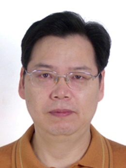
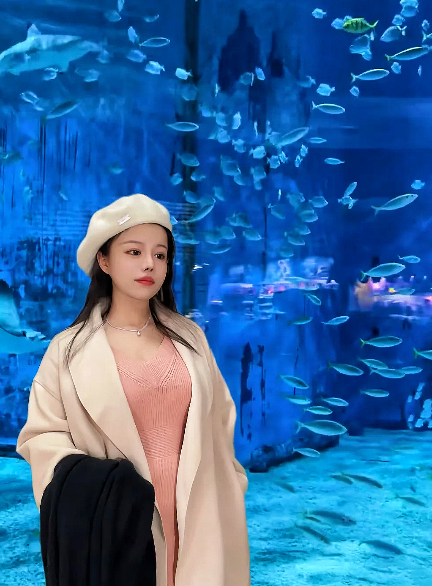
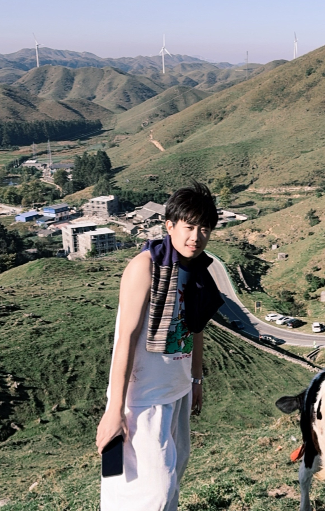
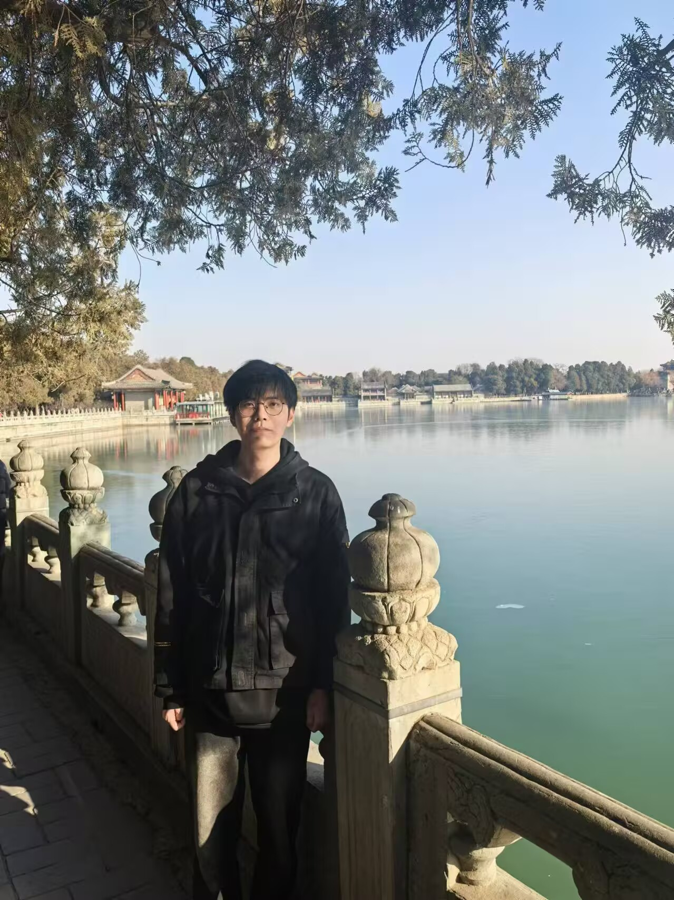
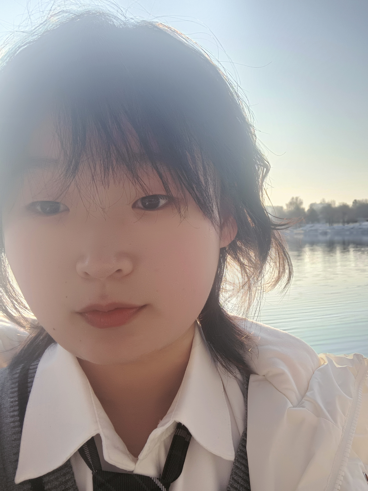
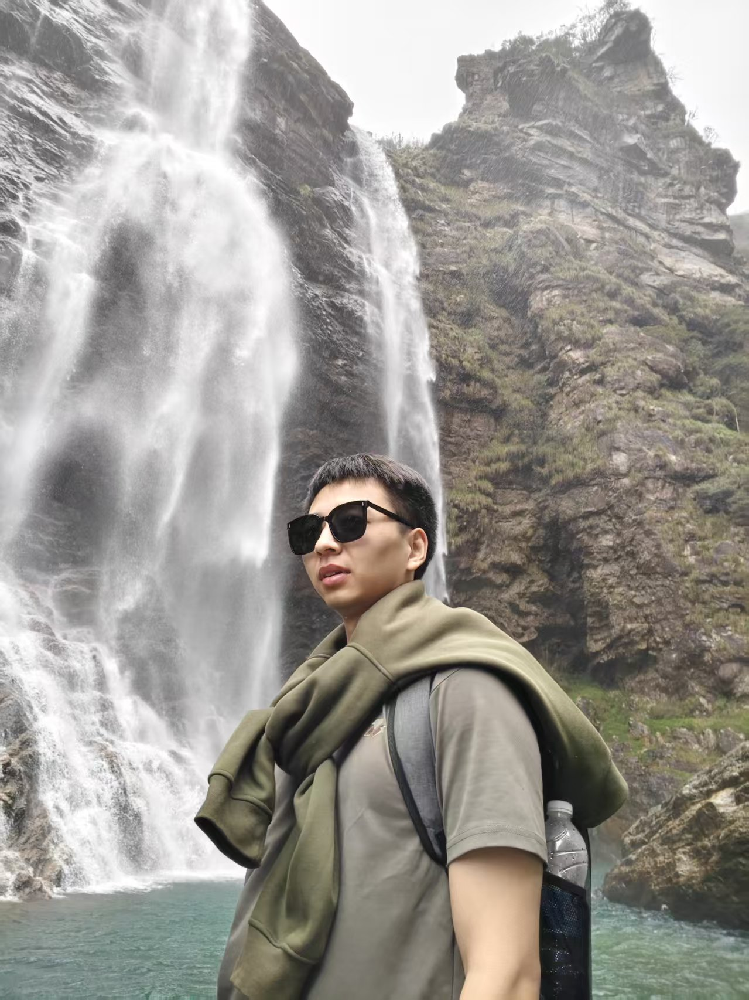
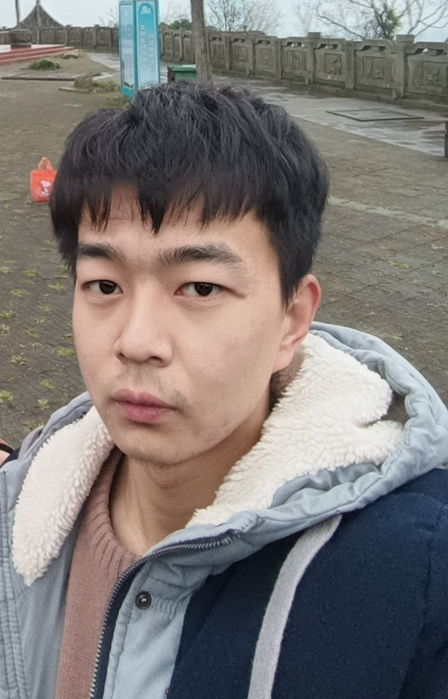

团队研究内容包括通遥融合、智能网络通信、地理信息安全等方向，重点开展星地融合传输、空天地一体化应急通信、地理空间信息全流程安全保护、行业大模型智能解析等研究。研究团队导师由徐彦彦教授和潘少明副教授组成，承担国家自然科学基金、国家重点研发计划等国家级、省部级重大科研项目，科研底蕴深厚、科研资源丰富。团队在各研究方向已形成深厚的科研积累与技术沉淀，自主研发天基信息实时传输系统、通遥融合巨型星座仿真系统、空天地异构通信网络实时传输系统等多款核心平台，成果支撑珞珈三号 01 星、东方慧眼星座等重大工程研发，团队师生在 TNSM、JAG、TDSC、IoT-J、通信学报等国内外权威期刊发表大量高水平论文，多项科研成果已落地业务单位实际应用。

## 团队导师

#### 徐正全：教授，博士生导师

1962 年出生， 教授，博士生导师，测绘遥感信息工程国家重点实验室多媒体通信工程中心主任。清华大学无线电技术与信息系统专业学士、通信与电子系统专业硕士、香港理工大学博士。主要研究领域：多媒体信息处理、多媒体网络通信、多媒体信息安全。先后主持或参与各类科研项目 20 余项，获得省部级科技进步一等奖一项、二等奖一项、市级科技进步奖一项。 在国内外发表学术论文二十余篇，其中十六余篇次被 SCI 、 EI 、 ISTP 等国际权威检索机构收录。

更多信息详见[教师主页](https://liesmars.whu.edu.cn/info/1168/5968.htm)

#### 潘少明：副教授，硕士生导师

男，1972年生，湖南省益阳人，工学博士，武汉大学测绘遥感信息工程全国重点实验室副教授，硕士生导师。长期从事分布式网络与信息系统理论方法的研究和软件平台开发工作。主要研究兴趣为：多媒体网络与通信技术、分布式计算及存储和遥感图像分类等。主持和参与了国家自然科学基金、重点研究计划、航天科技集团基金等项目。曾获得湖北省科技进步贰等奖、人工智能大赛优秀指导老师等。

更多信息详见[教师主页](https://liesmars.whu.edu.cn/info/1168/5972.htm)

## 在读博士

  <figure class="student-card">
    
    <figcaption>
      <a class="student-name">毛养素</a>
      
博士研究生

      
研究领域：地理信息安全

    </figcaption>
  </figure>
  <figure class="student-card">
    
    <figcaption>
      <a class="student-name">徐雅鑫</a>
      
博士研究生

      
研究领域：地理信息安全

    </figcaption>
  </figure>
  <figure class="student-card">
    
    <figcaption>
      <a class="student-name">王炳棋</a>
      
博士研究生

      
研究领域：空天地一体化传输

    </figcaption>
  </figure>

<figure class="student-card">
    
    <figcaption>
      <a class="student-name">于创宇</a>
      
博士研究生

      
研究领域：空天地一体化传输

    </figcaption>
  </figure>
<figure class="student-card">
    
    <figcaption>
      <a class="student-name">罗智辉</a>
      
博士研究生

      
研究领域：地理信息安全

    </figcaption>
  </figure>

<h3>在读硕士</h3>

  <figure class="student-card">
    
    <figcaption>
      <a class="student-name">王一枭</a>
      
硕士研究生

      
研究方向：空天地一体化传输

    </figcaption>
  </figure>
  <figure class="student-card">
    
    <figcaption>
      <a class="student-name">侯林超</a>
      
硕士研究生

      
研究方向：空天地一体化传输

    </figcaption>
  </figure>
  <figure class="student-card">
    
    <figcaption>
      <a class="student-name">林振</a>
      
硕士研究生

      
研究方向：空天地一体化传输

    </figcaption>
  </figure>
  <figure class="student-card">
    
    <figcaption>
      <a class="student-name">谢光珍</a>
      
硕士研究生

      
研究方向：空天地一体化传输

    </figcaption>
  </figure>
  <figure class="student-card">
    
    <figcaption>
      <a class="student-name">宗可琦</a>
      
硕士研究生

      
研究方向：地理信息安全

    </figcaption>
  </figure>
  <figure class="student-card">
    
    <figcaption>
      <a class="student-name">刘天悦</a>
      
硕士研究生

      
研究方向：空天地一体化传输

    </figcaption>
  </figure>
  <figure class="student-card">
    
    <figcaption>
      <a class="student-name">万兴波</a>
      
硕士研究生

      
研究方向：地理信息安全

    </figcaption>
  </figure>
  <figure class="student-card">
    
    <figcaption>
      <a class="student-name">周诗杭</a>
      
硕士研究生

      
研究方向：空天地一体化传输

    </figcaption>
  </figure>
  <figure class="student-card">
    
    <figcaption>
      <a class="student-name">罗哲伟</a>
      
硕士研究生

      
研究方向：空天地一体化传输

    </figcaption>
  </figure>
  <figure class="student-card">
    
    <figcaption>
      <a class="student-name">李嘉俊</a>
      
硕士研究生

      
研究方向：空天地一体化传输

    </figcaption>
  </figure>

**毕业生信息详见[学生培养](http://localhost:1313/students/)**

## 课题组风采展示

  

    

      <figure class="hb-carousel__slide">
        
        <figcaption>课题组2026年毕业合影</figcaption>
      </figure>
      <figure class="hb-carousel__slide">
        
        <figcaption>学术交流</figcaption>
      </figure>
      <figure class="hb-carousel__slide">
        
        <figcaption>学术交流</figcaption>
      </figure>
      <figure class="hb-carousel__slide">
        
        <figcaption>学术交流</figcaption>
      </figure>
      <figure class="hb-carousel__slide">
        
        <figcaption>学术交流</figcaption>
      </figure>
      <figure class="hb-carousel__slide">
        
        <figcaption>野外测试</figcaption>
      </figure>
      <figure class="hb-carousel__slide">
        
        <figcaption>野外测试</figcaption>
      </figure>
      <figure class="hb-carousel__slide">
        
        <figcaption>合照</figcaption>
      </figure>
      <figure class="hb-carousel__slide">
          
          <figcaption>合照</figcaption>
      </figure>
      <figure class="hb-carousel__slide">
        
        <figcaption>合照</figcaption>
      </figure>
      <figure class="hb-carousel__slide">
        
        <figcaption>合照</figcaption>
      </figure>
    

  

  <button class="hb-carousel__nav hb-carousel__nav--prev" type="button" aria-label="上一张">‹</button>
  <button class="hb-carousel__nav hb-carousel__nav--next" type="button" aria-label="下一张">›</button>
  

  

