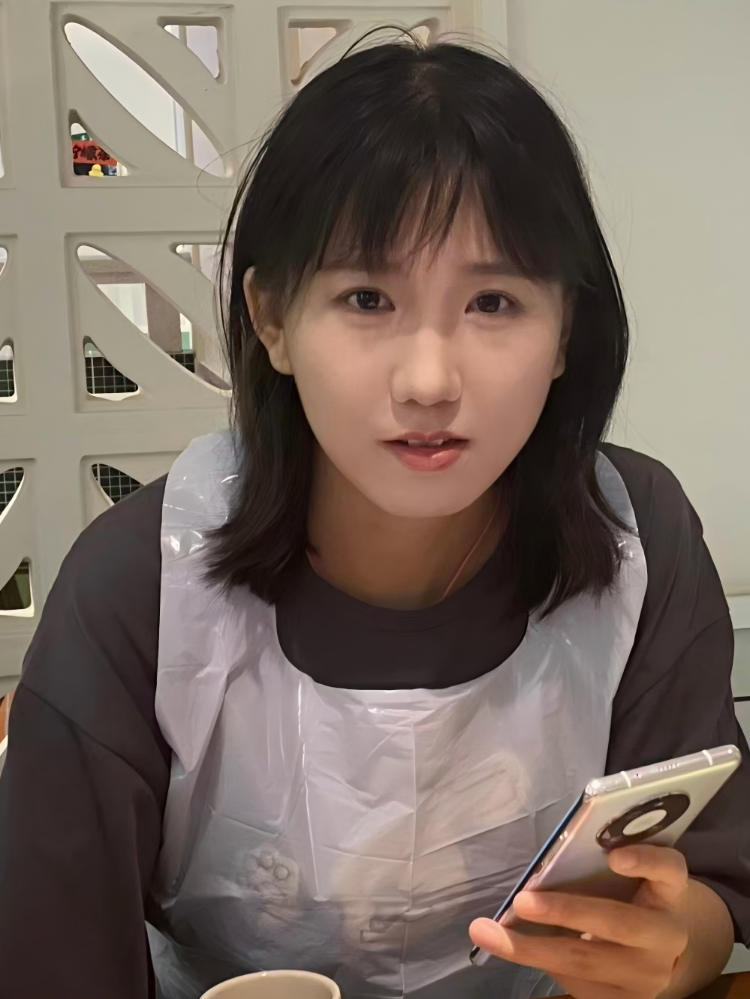
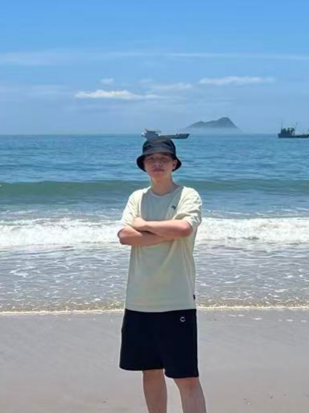
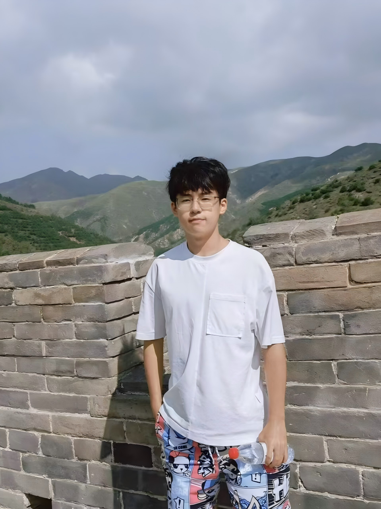

团队研究内容包括时空数据安全、智能网络通信、空间信息实时传输等方向，重点开展星地融合传输、空天地一体化应急通信、地理空间信息全流程安全保护、行业大模型智能解析等研究。研究团队导师由徐彦彦教授、徐正全教授和潘少明副教授组成，承担国家自然科学基金、国家重点研发计划等国家级、省部级重大科研项目，科研底蕴深厚、科研资源丰富。团队在各研究方向已形成深厚的科研积累与技术沉淀，自主研发天基信息实时传输系统、通遥融合巨型星座仿真系统、空天地异构通信网络实时传输系统等多款核心平台，成果支撑珞珈三号 01 星、东方慧眼星座等重大工程研发，团队师生在 TDSC、TCSVT、TGRS、JAG、loT-J、测绘学报、通信学报等国内外权威期刊发表大量高水平论文，多项科研成果已落地业务单位实际应用。

## 团队导师

#### 徐正全：教授，博士生导师

徐正全，男，1962年出生，博士，武汉大学教授（二级），博士生导师，享受国务院政府特殊津贴专家。先后担任武汉大学校园信息化建设专家、武汉市政务信息化建设专家、湖北省政务信息化建设专家。

从事视频信息处理、视频编解码与网络传输研究与工程实践，曾经主持研制出国内最早的视频会议全套系统之一，并因此获得国务院政府特殊津贴，湖北省科技进步奖。在基于视觉感知的视频信号处理方面的研究，为基于视觉感知的可视媒体加密与信息隐藏的系统研究奠定了初步的理论基础，获得三项国家发明专利，并分别获得湖北省、武汉市科技进步奖、中国人民解放军科技进步奖；
研究可视媒体与遥感信息的高效内容加密方法、数字水印与指纹技术、篡改检测与源认证算法，撰写了学术专著《可视媒体信息安全》，从可视媒体存储、传输、访问控制和使用中的安全出发，系统总结和介绍了国内外同行以及研究团队多年来在可视媒体信息安全理论、方法和关键技术方面的最新研究成果；
作为国家973计划课题负责人对基于云平台的空间信息数据服务展开了系统性的研究，对多源异构多维空间数据的分布式存储、大规模用户服务和云平台的安全与协议进行了深入研究，发表了众多高水平的学术论文，形成了多项重要的发明专利，并主持研发了面向数字城市的实时跨媒体信息存储与公众服务系统平台，为数字（智慧）城市系统建设突破数据存储技术瓶颈提供技术支持与解决方案；
近年来，面向日益凸显的移动位置服务中的隐私保护问题，研究位置数据的差分隐私保护方法，不断发展和完善了差分隐私保护理论，逐步突破了位置隐私保护中的科学难题和应用瓶颈，特别是提出了相关性拉普拉斯噪声机制，不但为强相关性的位置时间序列提供更高强度的隐私保护和更好的数据可用性，更为解决目前差分隐私保护理论对相关性数据保护强度不高基础性难题提供了突破性机制，在领域内受到广泛关注；撰写专著《北斗时空大数据隐私保护》，针对时空数据的特征，利用差分隐私技术，关注位置服务、位置签到、轨迹发布、时空数据分析等方面的隐私保护问题，在时空数据分析挖掘、密码学、差分隐私等方面基础理论的基础上，围绕时空轨迹发布差分隐私保护、时空大数据分析差分隐私保护等时空大数据隐私保护的基础理论方法、关键技术和应用进行了较为全面的介绍；
先后主持或参与国家973计划、国家863计划、国家自然科学基金及其他省部级科研和产业化项目二十余项；获得省部级科技进步一等奖、二等奖和三等奖各一项，军队科技进步三等奖一项，市级科技进步奖二项；取得国家发明专利四十余项，在国内外发表学术论文百余篇。

#### 潘少明：副教授，硕士生导师

男，1972年生，湖南省益阳人，工学博士，武汉大学测绘遥感信息工程全国重点实验室副教授，硕士生导师。长期从事分布式网络与信息系统理论方法的研究和软件平台开发工作。主要研究兴趣为：多媒体网络与通信技术、分布式计算及存储和遥感图像分类等。主持和参与了国家自然科学基金、重点研究计划、航天科技集团基金等项目。曾获得湖北省科技进步贰等奖、人工智能大赛优秀指导老师等。

**教育经历：**

(1) 2003-09 至 2009-07, 武汉大学, 通信与信息系统, 博士

(2) 1995-09 至 1998-07, 华中科技大学, 船舶与海洋结构物设计制造, 硕士

(3) 1991-09 至 1995-07, 华中科技大学, 船舶工程, 学士

**科研与学术工作经历：**

(1) 2009-11 至 今, 武汉大学, 测绘遥感信息工程国家重点实验室, 副研究员

(2) 2014-08 至 2015-08, 美国乔治梅森大学, 地理和地理信息科学系, 无

(3) 2000-11 至 2009-11, 武汉大学, 测绘遥感信息工程国家重点实验室, 助理研究员

(4) 1998-07 至 2000-11, 武汉大学, 多媒体网络通信工程湖北省重点实验室, 研究实习员

更多信息详见[教师主页](https://liesmars.whu.edu.cn/info/1168/5972.htm)

## 学生获奖
1. ISPRS Geospatial Week最佳专题论文奖，2025年
2. 通感智达——通信-定位-遥感天地一体精密组网应急先锋，国际大学生创新大赛银奖，2024年
3. 第九届全国地理信息科学博士生学术论文优秀报告奖，2020年
4. 第一届中国研究生人工智能创新大赛一等奖，2019年

## 在读博士

  <figure class="student-card">
    
    <figcaption>
      <a class="student-name">毛养素</a>
      
博士研究生

      
研究领域：时空数据安全

    </figcaption>
  </figure>
  <figure class="student-card">
    
    <figcaption>
      <a class="student-name">徐雅鑫</a>
      
博士研究生

      
研究领域：时空数据安全

    </figcaption>
  </figure>
  <figure class="student-card">
    
    <figcaption>
      <a class="student-name">王炳棋</a>
      
博士研究生

      
研究领域：通信-遥感融合

    </figcaption>
  </figure>

  <figure class="student-card">
    
    <figcaption>
      <a class="student-name">于创宇</a>
      
博士研究生

      
研究领域：空天地一体化传输

    </figcaption>
  </figure>
  <figure class="student-card">
    
    <figcaption>
      <a class="student-name">罗智辉</a>
      
博士研究生

      
研究领域：时空数据安全

    </figcaption>
  </figure>
  <figure class="student-card">
    
    <figcaption>
      <a class="student-name">杜佶欣</a>
      
博士研究生

      
研究领域：时空数据安全

    </figcaption>
  </figure>

<h3>在读硕士</h3>

  <figure class="student-card">
    
    <figcaption>
      <a class="student-name">王一枭</a>
      
本科院校：西安电子科技大学

      
研究方向：空天地一体化传输

    </figcaption>
  </figure>
  <figure class="student-card">
    
    <figcaption>
      <a class="student-name">侯林超</a>
      
本科院校：郑州大学

      
研究方向：空天地一体化传输

    </figcaption>
  </figure>
  <figure class="student-card">
    
    <figcaption>
      <a class="student-name">林振</a>
      
本科院校：集美大学

      
研究方向：大语言模型

    </figcaption>
  </figure>
  <figure class="student-card">
    
    <figcaption>
      <a class="student-name">陈健</a>
      
本科院校：山东大学

      
研究方向：时空数据安全

    </figcaption>
  </figure>
  <figure class="student-card">
    
    <figcaption>
      <a class="student-name">谢光珍</a>
      
本科院校：吉林大学

      
研究方向：空天地一体化传输

    </figcaption>
  </figure>
  <figure class="student-card">
    
    <figcaption>
      <a class="student-name">宗可琦</a>
      
本科院校：南京理工大学

      
研究方向：时空数据安全

    </figcaption>
  </figure>
  <figure class="student-card">
    
    <figcaption>
      <a class="student-name">刘天悦</a>
      
本科院校：吉林大学

      
研究方向：空天地一体化传输

    </figcaption>
  </figure>
  <figure class="student-card">
    
    <figcaption>
      <a class="student-name">万兴波</a>
      
本科院校：武汉工程大学

      
研究方向：时空数据安全

    </figcaption>
  </figure>
  <figure class="student-card">
    
    <figcaption>
      <a class="student-name">周诗杭</a>
      
本科院校：成都理工大学

      
研究方向：通信-遥感融合

    </figcaption>
  </figure>
  <figure class="student-card">
    
    <figcaption>
      <a class="student-name">罗哲伟</a>
      
本科院校：郑州大学

      
研究方向：时空数据安全

    </figcaption>
  </figure>
  <figure class="student-card">
    
    <figcaption>
      <a class="student-name">李嘉俊</a>
      
本科院校：郑州大学

      
研究方向：空天地一体化传输

    </figcaption>
  </figure>
  <figure class="student-card">
    
    <figcaption>
      <a class="student-name">杜佳乐</a>
      
本科院校：武汉理工大学

      
研究方向：空天地一体化传输

    </figcaption>
  </figure>

## 学生就业

| 姓名   | 毕业年份 | 毕业学位 | 毕业去向                   |
| ------ | -------- | -------- | -------------------------- |
| 王志恒 | 2025     | 博士     | 河南大学                   |
| 欧阳雪 | 2024     | 博士     | 广西师范大学               |
| 闫悦菁 | 2023     | 博士     | 陕西师范大学               |
| 饶哲恒 | 2022     | 博士     | 杭州电子科技大学           |
| 王冬   | 2021     | 博士     | 杭州电子科技大学           |
| 王豪   | 2021     | 博士     | 重庆邮电大学               |
| 贾姗   | 2021     | 博士     | Google                     |
| 王涛   | 2019     | 博士     | 华中师范大学               |
| 熊礼治 | 2017     | 博士     | 南京信息工程大学           |
| 蒋力   | 2015     | 博士     | 郑州大学                  |
| 刘进   | 2014     | 博士     | 武汉理工大学               |
| 姚晔   | 2013     | 博士     | 杭州电子科技大学           |
| 王一枭 | 2026     | 硕士     | 华为                      |
| 侯林超 | 2026     | 硕士     | 京东                      |
| 陈健   | 2026     | 硕士     | 厦门烟草                   |
| 林振   | 2026     | 硕士     | 福建晋华                   |
| 于创宇 | 2025     | 硕士     | 武大直博                   |
| 王炳棋 | 2025     | 硕士     | 武大直博                   |
| 张爽   | 2025     | 硕士     | 中元华电科技股份有限公司    |
| 张博   | 2024     | 硕士     | 中国移动                   |
| 孔凌辉 | 2023     | 硕士     | 蚂蚁金服                   |
| 刘鑫   | 2023     | 硕士     | 阿里巴巴                   |
| 陈世河 | 2023     | 硕士     | 中国农业银行湖北分行       |
| 徐跃   | 2023     | 硕士     | 中兴通讯                   |
| 孟磊   | 2022     | 硕士     | 中国金融期货交易所技术公司 |
| 陶玉龙 | 2022     | 硕士     | 阿里巴巴                   |
| 毛养素 | 2022     | 硕士     | 武大直博                   |
| 王志恒 | 2021     | 硕士     | 武大直博                   |
| 张逸然 | 2021     | 硕士     | 中国移动研究院             |
| 王玉杰 | 2021     | 硕士     | 中国农业银行               |
| 刘佳彤 | 2020     | 硕士     | 武大直博                   |
| 宋方振 | 2020     | 硕士     | 今日头条                   |
| 赵啸   | 2020     | 硕士     | 华为                      |
| 史燕飞 | 2018     | 硕士     | 腾讯                      |
| 龚佳颖 | 2018     | 硕士     | 深圳平安                  |
| 赵继宗 | 2017     | 硕士     | 网易                      |
| 张文婷 | 2017     | 硕士     | 阿里巴巴                  |
| 韩威  | 2016     | 硕士     | 腾讯                      |
| 占克友 | 2015     | 硕士     | 腾讯                      |
| 王慧颖 | 2013     | 硕士     | 中兴通讯                  |
| 张玉霞 | 2012     | 硕士     | 中兴通讯                  |
| 王崇欢 | 2012     | 硕士     | 百度                      |
| 李伟  | 2009     | 硕士     | 360安全                   |
| 邓雄书 | 2008     | 硕士     | 百度                      |
| 张镭  | 2008     | 硕士     | 美国微软公司               |

## 课题组风采展示

  

    

      <figure class="hb-carousel__slide">
        
        <figcaption>2026年课题组毕业合影</figcaption>
      </figure>
      <figure class="hb-carousel__slide">
        
        <figcaption>2025年，迪拜，ISPRS GeoSpatial Week学术会议</figcaption>
      </figure>
      <figure class="hb-carousel__slide">
        
        <figcaption>2024年，澳大利亚，珀斯，UPINLBS国际学术会议</figcaption>
      </figure>
      <figure class="hb-carousel__slide">
        
        <figcaption>2022年，中国，重庆，CIHW学术会议</figcaption>
      </figure>
      <figure class="hb-carousel__slide">
        
        <figcaption>2024年，中国，香港，AsiaCarto国际学术会议</figcaption>
      </figure>
      <figure class="hb-carousel__slide">
        
        <figcaption>香港理工大学访问</figcaption>
      </figure>
      <figure class="hb-carousel__slide">
        
        <figcaption>野外测试</figcaption>
      </figure>
      <figure class="hb-carousel__slide">
        
        <figcaption>野外考察</figcaption>
      </figure>
      <figure class="hb-carousel__slide">
        
        <figcaption>联调测试</figcaption>
      </figure>
      <figure class="hb-carousel__slide">
        
        <figcaption>2024年教师节合照</figcaption>
      </figure>
      <figure class="hb-carousel__slide">
          
          <figcaption>2024年课题组毕业合影</figcaption>
      </figure>
      <figure class="hb-carousel__slide">
        
        <figcaption>2023年团建合照</figcaption>
      </figure>
      <figure class="hb-carousel__slide">
        
        <figcaption>学生合照</figcaption>
      </figure>
    

  

  <button class="hb-carousel__nav hb-carousel__nav--prev" type="button" aria-label="上一张">‹</button>
  <button class="hb-carousel__nav hb-carousel__nav--next" type="button" aria-label="下一张">›</button>
  

  

