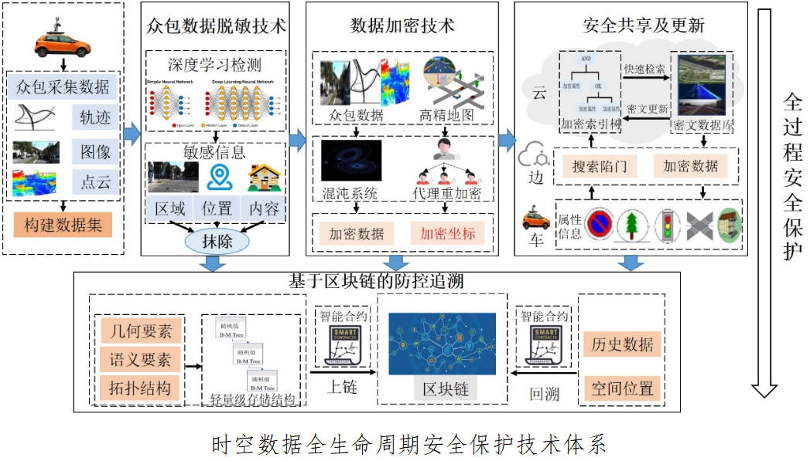
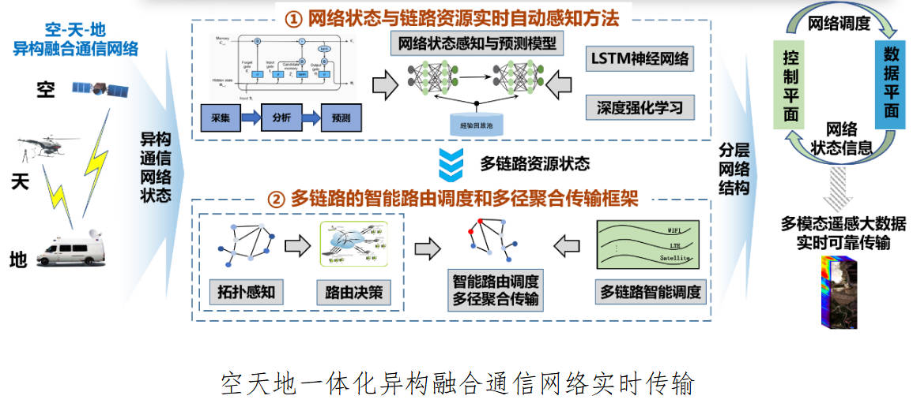
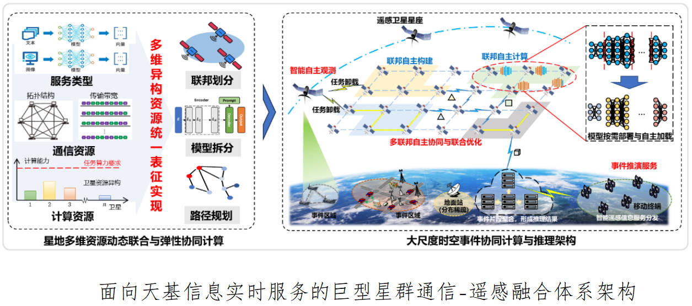

## 时空数据安全

面向精度高、涉密广的时空数据对采集、传输、共享、使用过程中的安全保护需求，构建涵盖时空数据安全采集、安全传输、安全检索访问、安全防控追溯的时空数据全生命周期安全保护理论与技术体系，提出包括基于深度学习的众包采集数据脱敏、基于差分隐私的矢量地图数据脱密、保持格式兼容的矢量地图数据高效加密、边缘环境下多源数据安全检索、云环境下可验证的海量数据安全检索、基于内积函数加密的隐私保护定位、基于区块链与交换密码水印的防控追溯等一系列技术方法，为时空数据的广泛、高效应用提供全生命周期安全保护。承担国家自然科学基金3项(No. 42271431，41571426，41101416)，国家重点研发计划子课题1项(No. 2021YFB2501103)、湖北省重大科技计划项目子课题 1项(2024BAA011)，相关研究成果发表在TDSC、TSC、IoT-J、TSCVT、KBS、测绘学报、通信学报等国内外重要国际学术期刊上，授权国家发明专利多项，并在自然资源、住建、电力等多个领域得到应用。获得地理信息科技进步奖特等奖、自然资源部科技进步奖一等奖、中国产学研合作促进会科技创新奖一等奖、江苏省科技进步奖二等奖、湖北省科技进步奖三等奖、武汉市科技进步奖二等奖。

## 空天地一体化智能网络通信

面向灾害应急等环境对海量、高精度数据实时传输的迫切需求，针对地面通信阻断环境下现有应急通信系统模式单一，难以实现海量应急响应信息实时可靠传输的问题，融合无线自组网、卫星通信网、LTE专网等多种通信网络，构建空天地一体化应急通信网络传输平台，提出异构通信网络融合方法、海量数据实时可靠传输方法与传输服务质量保障机制，自主研发空天地异构通信网络实时传输系统，研制异构网络融合终端设备，实现海量、多源业务数据的远距离、高速、实时、可靠传输。承担国家重点研发计划项目子课题3项（No. 2024YFC3015403, No. 2022YFB3903404, No.2017YFB0504202）， 获得相关软件著作权、授权国家发明专利多项，在TGRS、TNSM、IoT-J、JAG、CC、PPNA等重要国际学术期刊上发表多篇论文。相关成果已在业务单位开展应用。

## 面向天基信息实时服务的通信-遥感融合

针对星地传输能力受限与星上处理能力受限，导致海量天基信息“下不来、算不动”，无法实现天基信息实时智能服务的难题，构建面向天基信息实时服务的通信-遥感融合体系架构，提出星群动态高维资源统一表征和资源优化方法，突破大尺度时空事件推理中全流程、多环节联合优化难题，提升数据处理与传输效率，保障海量天基信息的高性能实时可靠传输。自主研发天基信息实时传输系统、通信-遥感融合巨型星座仿真系统，成果支撑了武汉大学全球首颗互联网智能遥感科学试验卫星“珞珈三号01星”及东方慧眼星座等重大项目研发。牵头编制中国通信标准化协会低轨卫星通遥融合行业标准。承担国家自然科学基金委重大研究计划子课题1项（No. 91738302），国家重点研发计划子课题1项(No. 2022YFB3902804)，在IoT-J、ICC、PPNA等重要国际学术期刊和会议上发表多篇论文。获得测绘科技进步奖一等奖1项。

