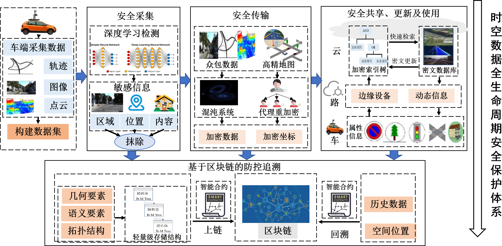
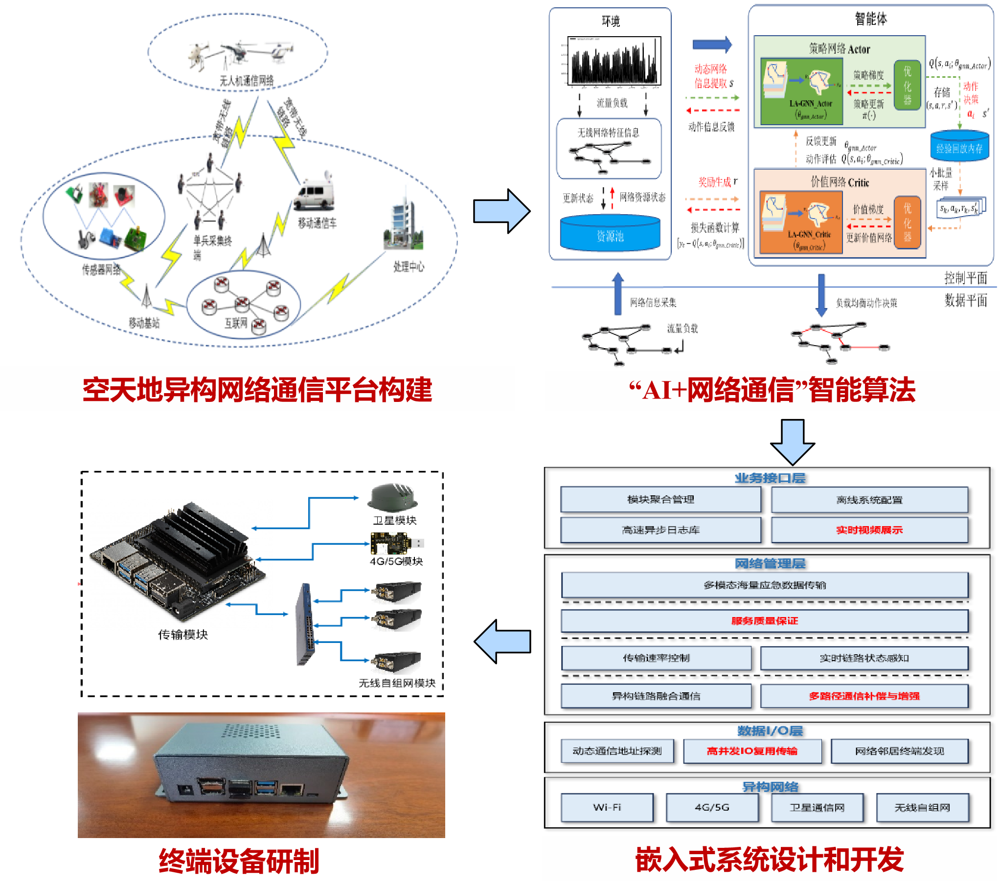
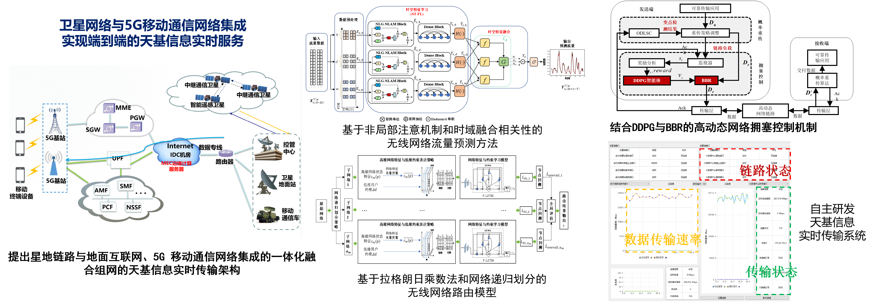

**时空数据安全**

安全是时空数据共享的前提和基础，通过研究安全采集与传输方法、云边协同的数据安全检索方法、云环境下的隐私保护定位方法和防控追溯方法，课题组率先构建覆盖时空数据采集、传输、共享使用到分发流通的全生命周期安全保护理论技术体系，旨在实现时空数据要素的自主可控与动态防护。

关键词:Image Retrieval/Watermarking/Content Protection

**智能网络通信**

现有单一通信模式、带宽有限且不稳定的信道难以支撑海量多模态遥感大数据实时可靠传输，通过研究网络流量预测、智能路由、网络分区与约束路由方法，课题组构建相互兼容、互为补充、动态协同的应急空天地一体化异构网络通信技术体系，旨在实现异构网络智能融合与资源动态调度。

关键词：Deep Learning / Routing / Network Service

**空间信息实时传输**

为解决面向天基信息实时服务的星地融合网络智能传输与资源协同问题，围绕遥感大数据、应急环境和天基信息网络，课题组研究高效、可靠、安全的空间信息传输与分发技术，旨在实现卫星数据从获取端到用户移动终端分钟级实时智能服务。

关键词：Remote Sensing Data / Real-time Transmission / Emergency Response

